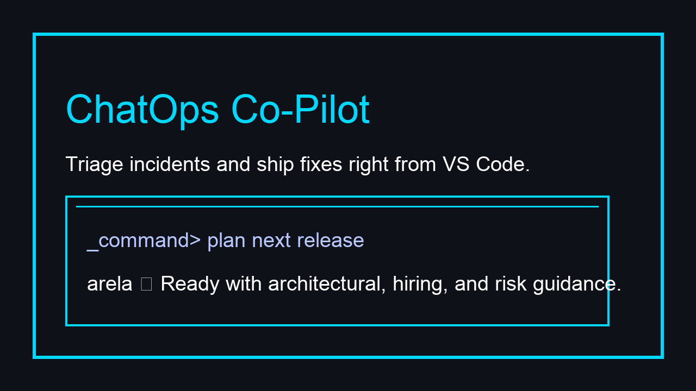
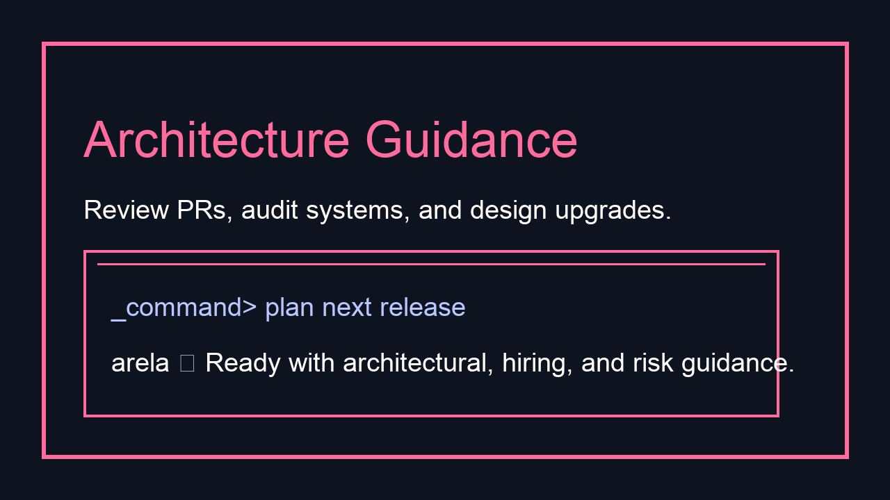
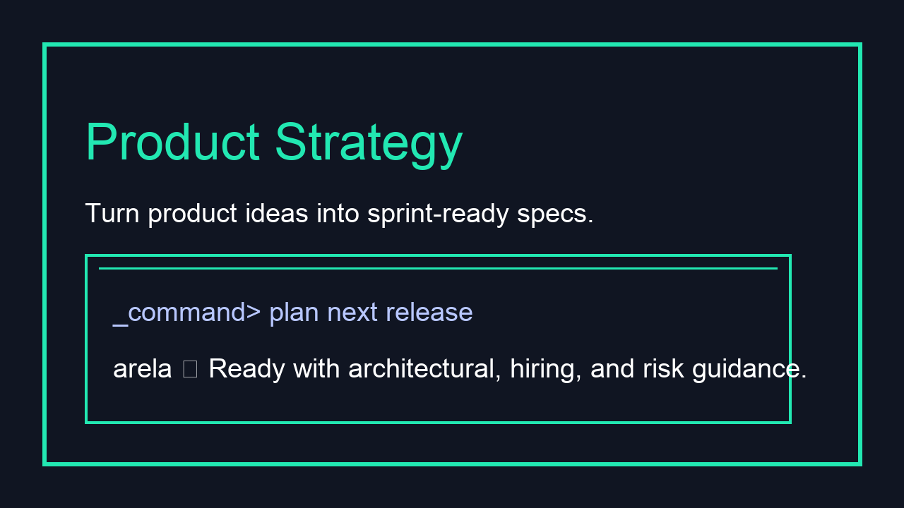
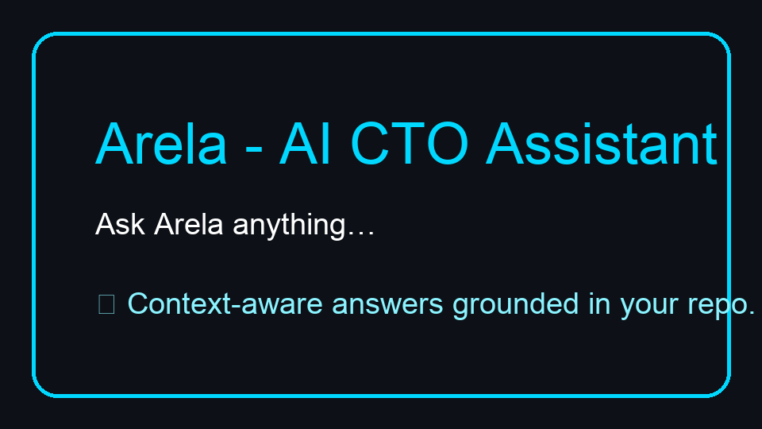

# Arela – AI CTO Assistant for VS Code

<p align="center">
  
</p>

Arela is your AI-powered technical co-founder that lives directly inside VS Code. Stay on top of architecture decisions, unblock teammates, and keep your roadmap healthy without ever leaving your editor.

---

## Features

1. **Live ChatOps Desk** – Pair-program with an AI CTO who already understands your repo, test results, and docs. <br/>
   
2. **Architecture + Delivery Insights** – Ask *"What breaks if we ship this?"* and get dependency callouts, suggested mitigations, and rollout plans. <br/>
   
3. **Product + Hiring Guidance** – Draft specs, score candidates, and convert product feedback into sprint-sized tickets with a single prompt. <br/>
   

---

## Installation

1. **Marketplace (recommended)** – Search for **"Arela - AI CTO Assistant"** inside VS Code Extensions once the listing is public, then click *Install*.
2. **Manual VSIX** – From this repository root run:
   ```bash
   npm install
   npm run build --workspace arela-extension
   (cd packages/extension && npx --yes vsce package --out arela.vsix)
   code --install-extension packages/extension/arela.vsix
   ```

---

## Usage



1. Launch the command palette and run `Arela: Open Chat` (shortcut below).
2. Drop in context using `Add Workspace Context` or drag files directly into the chat window.
3. Ask for architectural advice, roadmap planning, hiring help, or production triage guidance.
4. Use `Select AI Model` to toggle between OpenAI, Anthropic, or local Ollama models.

---

## Configuration

| Setting | Description |
| --- | --- |
| `arela.provider` | Choose `openai`, `anthropic`, or `ollama` depending on your stack. |
| `arela.model` | Default model identifier for the selected provider. |
| `arela.openai.apiKey` | Store your OpenAI API key (kept locally by VS Code). |
| `arela.anthropic.apiKey` | Anthropic API key for Claude models. |
| `arela.ollama.enabled` | Toggle local inference via Ollama. |
| `arela.ollama.baseUrl` | Override Ollama host/port if self-hosting elsewhere. |

Configuration lives under **Settings → Extensions → Arela** or via the `Arela: Open Settings` command.

---

## Keyboard Shortcuts

| Command | macOS | Windows/Linux |
| --- | --- | --- |
| `Arela: Open Chat` | `⌘⇧A` | `Ctrl+Shift+A` |
| `Arela: New Conversation` | bind via Keyboard Shortcuts UI | bind via Keyboard Shortcuts UI |
| `Arela: Select AI Model` | bind via Keyboard Shortcuts UI | bind via Keyboard Shortcuts UI |

Tip: search for "Arela" inside the Keyboard Shortcuts editor to personalize every workflow trigger.

---

## Requirements

- Visual Studio Code **1.85.0** or later
- Node.js **18+** to run the local Arela CLI/server (handled automatically when using the published extension bundle)
- Valid API keys for your preferred AI providers (OpenAI, Anthropic, or a running Ollama instance)

---

## Known Issues

- Long-running chats with extremely large workspaces may need a manual `Add Workspace Context` refresh.
- Ollama streaming currently requires the default `http://localhost:11434` endpoint.
- Windows users must have the VS Code terminal configured for UTF-8 for perfect log rendering.

Please open issues on [GitHub](https://github.com/NewDara-Star/arela/issues) with reproduction steps so we can fix them quickly.

---

## Changelog

All notable changes are documented in [`CHANGELOG.md`](./CHANGELOG.md).
