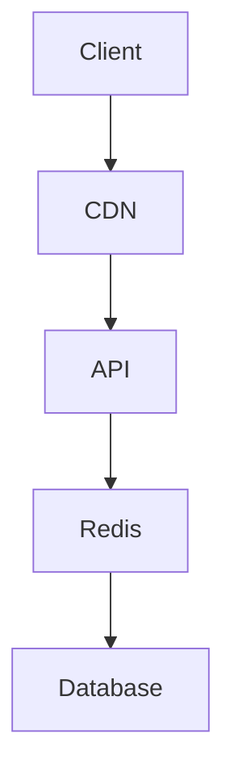

# Delegate Agent Ticket Workflow

## Purpose

Create clear, actionable tickets for Codex or Claude agents to execute independently.

## When to Use

- User requests a feature that can be delegated
- Task is well-defined and scoped
- Agent has the right specialization for the task

## Template

```markdown
# Ticket: [AGENT]-[ID] - [Title]

**Agent:** @codex | @claude  
**Priority:** high | medium | low  
**Complexity:** simple | medium | complex  
**Estimated tokens:** [rough estimate]  
**Cost estimate:** $[amount]  

## Context

[1-2 paragraphs explaining why this task exists and how it fits into the bigger picture]

## Requirements

- [ ] Functional requirement 1
- [ ] Functional requirement 2
- [ ] Non-functional requirement 1
- [ ] Non-functional requirement 2

## Acceptance Criteria

- [ ] Criterion 1 (testable)
- [ ] Criterion 2 (testable)
- [ ] Criterion 3 (testable)

## Technical Specification

### Files to Create/Modify

```
src/
├── api/
│   └── auth.ts (create)
├── middleware/
│   └── auth.ts (create)
└── types/
    └── auth.ts (modify)
```

### API Contracts

```typescript
// Example interfaces, types, or API signatures
interface AuthRequest {
  email: string;
  password: string;
}

interface AuthResponse {
  token: string;
  user: User;
}
```

### Implementation Notes

- Follow existing patterns in `src/api/`
- Use the same error handling as other endpoints
- JWT tokens should expire in 24h
- Hash passwords with bcrypt (12 rounds)

## Test Requirements

### Unit Tests Required

- [ ] Test 1: Valid login returns token
- [ ] Test 2: Invalid password returns 401
- [ ] Test 3: Non-existent user returns 404

### Integration Tests Required

- [ ] Test 1: Full auth flow works end-to-end
- [ ] Test 2: Token refresh works

### Test Files

```
tests/
├── unit/
│   └── auth.test.ts (create)
└── integration/
    └── auth-flow.test.ts (create)
```

## Dependencies

- [ ] Database schema must be migrated first (Ticket CODEX-042)
- [ ] User model must exist (Ticket CODEX-041)
- [ ] JWT secret must be in env vars

## Reference Materials

- ADR: `docs/adr/005-authentication-strategy.md`
- Design: `docs/design/auth-flow.md`
- Existing patterns: `src/api/users.ts`
- Security guide: `docs/security/auth-best-practices.md`

## Definition of Done

- [ ] All requirements met
- [ ] All acceptance criteria pass
- [ ] All tests written and passing
- [ ] Code follows project style guide
- [ ] No linting errors
- [ ] Documentation updated
- [ ] `npx arela doctor --eval` passes

## Rollback Plan

If this breaks production:
1. Revert commit [commit-hash]
2. Re-deploy previous version
3. Investigate issue
4. Create hotfix ticket

## Questions for Agent

If you encounter any of these, stop and ask:

- Unclear requirement
- Missing dependency
- Conflicting patterns
- Security concern
- Performance concern

## Estimated Timeline

- Simple: 15-30 minutes
- Medium: 30-60 minutes
- Complex: 1-2 hours

## Success Metrics

- Implementation matches spec: 100%
- Tests pass: 100%
- Arela doctor passes: 100%
- No security vulnerabilities: 100%

---

**Agent:** You have everything you need. Execute this ticket independently and report back when complete.
```

## Example: Codex Ticket

```markdown
# Ticket: CODEX-123 - Implement User Profile API

**Agent:** @codex  
**Priority:** high  
**Complexity:** simple  
**Estimated tokens:** 2K  
**Cost estimate:** $0.004  

## Context

Users need to view and update their profile information. This is a standard CRUD endpoint following our existing API patterns.

## Requirements

- [ ] GET /api/users/:id returns user profile
- [ ] PUT /api/users/:id updates user profile
- [ ] Only authenticated users can access
- [ ] Users can only update their own profile

## Acceptance Criteria

- [ ] GET returns 200 with user data for valid ID
- [ ] GET returns 404 for non-existent user
- [ ] GET returns 401 for unauthenticated request
- [ ] PUT updates user and returns 200
- [ ] PUT returns 403 if user tries to update another user
- [ ] PUT validates input data

## Technical Specification

### Files to Modify

```
src/api/users.ts (add endpoints)
src/types/user.ts (already exists)
```

### API Contracts

```typescript
// GET /api/users/:id
interface UserProfileResponse {
  id: string;
  name: string;
  email: string;
  avatar?: string;
  createdAt: string;
}

// PUT /api/users/:id
interface UpdateProfileRequest {
  name?: string;
  avatar?: string;
}
```

### Implementation Notes

- Follow pattern in `src/api/posts.ts`
- Use `requireAuth` middleware
- Use `validateUser` middleware for ownership check
- Validate input with Zod schema

## Test Requirements

### Unit Tests Required

- [ ] GET returns user profile
- [ ] GET returns 404 for invalid ID
- [ ] PUT updates user profile
- [ ] PUT validates input

### Test Files

```
tests/api/users.test.ts (modify)
```

## Dependencies

- [ ] None - all dependencies exist

## Reference Materials

- Existing pattern: `src/api/posts.ts`
- Middleware: `src/middleware/auth.ts`
- User type: `src/types/user.ts`

## Definition of Done

- [ ] Both endpoints implemented
- [ ] All tests passing
- [ ] No TypeScript errors
- [ ] `npx arela doctor` passes

---

**Agent:** Execute this ticket. Report back when complete.
```

## Example: Claude Ticket

```markdown
# Ticket: CLAUDE-045 - Design Caching Strategy

**Agent:** @claude  
**Priority:** medium  
**Complexity:** complex  
**Estimated tokens:** 5K  
**Cost estimate:** $0.075  

## Context

Our API is experiencing high database load. We need a comprehensive caching strategy that balances performance, consistency, and complexity.

## Requirements

- [ ] Design multi-layer caching strategy
- [ ] Define cache invalidation rules
- [ ] Specify cache key patterns
- [ ] Consider edge cases and failure modes

## Acceptance Criteria

- [ ] Architecture diagram provided (mermaid)
- [ ] ADR document written
- [ ] Implementation plan with phases
- [ ] Performance projections documented
- [ ] Security implications addressed

## Technical Specification

### Current State

- Database: PostgreSQL
- API: Express.js
- Current load: 1000 req/s
- P95 latency: 250ms
- Database CPU: 80%

### Constraints

- Budget: $500/month for caching infrastructure
- Consistency: Eventual consistency acceptable (< 5s)
- Availability: 99.9% uptime required

### Questions to Answer

1. Which caching layers? (CDN, Redis, in-memory)
2. What to cache? (API responses, database queries, computed values)
3. Cache invalidation strategy? (TTL, event-based, manual)
4. How to handle cache failures? (fallback, circuit breaker)
5. How to monitor cache effectiveness?

## Deliverables

### 1. Architecture Diagram



### 2. ADR Document

Create `docs/adr/012-caching-strategy.md` with:
- Context and problem statement
- Decision drivers
- Considered options
- Decision outcome
- Consequences

### 3. Implementation Plan

Phase 1: [...]
Phase 2: [...]
Phase 3: [...]

### 4. Performance Projections

- Expected latency improvement: [...]
- Expected database load reduction: [...]
- Expected cost: [...]

## Dependencies

- [ ] None - this is a design task

## Reference Materials

- Current architecture: `docs/architecture/overview.md`
- Performance metrics: `docs/metrics/api-performance.md`
- Budget constraints: `docs/budget/infrastructure.md`

## Definition of Done

- [ ] All deliverables provided
- [ ] Architecture is sound and scalable
- [ ] Implementation plan is actionable
- [ ] Team reviewed and approved

---

**Agent:** Analyze deeply and provide comprehensive design. Take your time to think through edge cases.
```

## Workflow Steps

### 1. Receive User Request

User: "Add user authentication"

### 2. Analyze & Break Down

You (Cascade):
- Is this one task or multiple?
- What's the complexity?
- Which agents are best suited?

### 3. Create Tickets

- CLAUDE-001: Design auth architecture
- CODEX-002: Implement auth API
- CODEX-003: Implement auth UI
- CODEX-004: Write auth tests
- CASCADE-005: Integration & review

### 4. Delegate

Post tickets to agents:
```
@claude - See ticket CLAUDE-001 in .arela/tickets/
@codex - See ticket CODEX-002 in .arela/tickets/
```

### 5. Monitor & Integrate

- Agents report back
- You review implementations
- Run `npx arela doctor --eval`
- Integrate if passing

### 6. Complete

- All tickets closed
- Feature complete
- Quality verified
- User notified

## Best Practices

### Clear Specs

✅ **Good:**
```
Implement POST /api/auth/login
- Accept email + password
- Return JWT token
- Hash passwords with bcrypt
- Return 401 if invalid
```

❌ **Bad:**
```
Make login work
```

### Right Agent

✅ **Good:**
```
@codex - Implement 20 CRUD endpoints
(Fast, cheap, perfect fit)
```

❌ **Bad:**
```
@claude - Implement 20 CRUD endpoints
(Expensive, overkill)
```

### Testable Criteria

✅ **Good:**
```
- [ ] Login with valid credentials returns 200
- [ ] Login with invalid password returns 401
- [ ] Login without email returns 400
```

❌ **Bad:**
```
- [ ] Login works correctly
```

## Summary

**Create tickets that agents can execute independently.**

- Clear context
- Specific requirements
- Testable criteria
- Reference materials
- Definition of done

**Result:** Agents work in parallel, you orchestrate, quality stays high.
